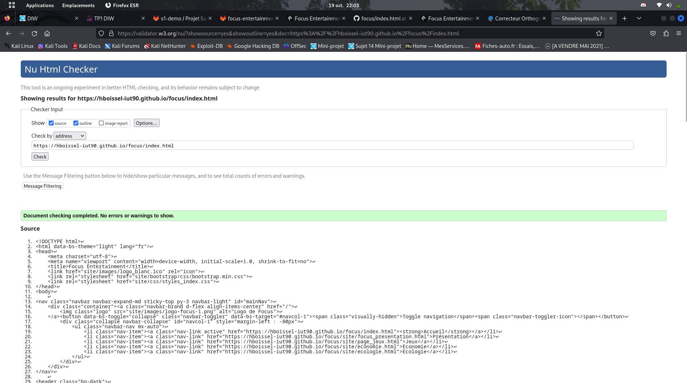
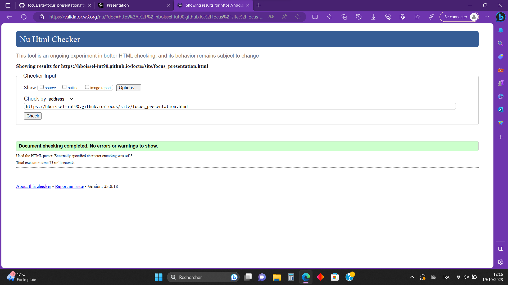
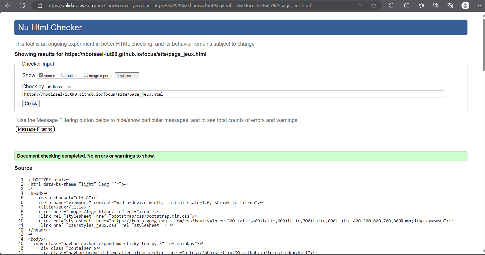
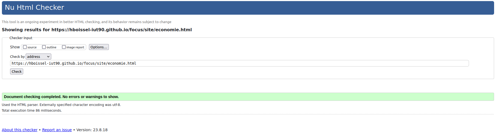
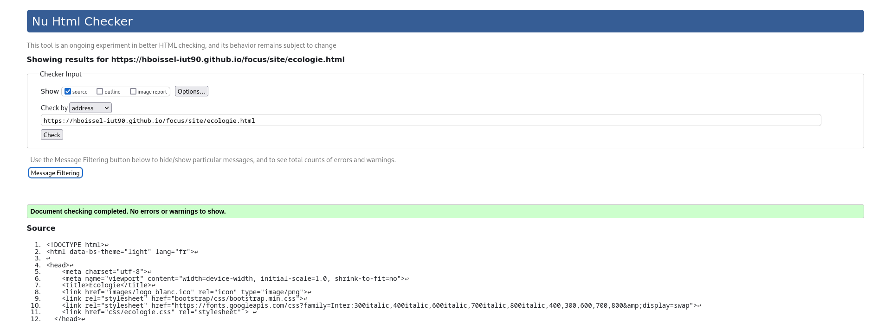

# Focus Entertainment
## Site du GitHub :

[Focus Entertainment](https://hboissel-iut90.github.io/focus/)

## Membres du groupe :

- [Boisselot Harry (référent)](mailto:harry.boisselot@edu.univ-fcomte.fr?subject=SAE_1_05_06)  
- [Vidy Enzo](mailto:enzo.vidy@edu.univ-fcomte.fr?subject=SAE_1_05_06)   
- [Urbain Thomas](mailto:thomas.urbain@edu.univ-fcomte.fr?subject=SAE_1_05_06)   
- [Ekici Sugdenaz](mailto:sugdenaz.ekici@edu.univ-fcomte.fr?subject=SAE_1_05_06)   
- [Caliskan Turker](mailto:turker.caliskan@edu.univ-fcomte.fr?subject=SAE_1_05_06)   

## Présentation 

Ce dépôt correspond à un site web créé en HTML/CSS/JS dans le cadre de la SAÉ 05-06 à l'IUT de Belfort secteur Informatique. Ce site présente des informations concernant l'entreprise Focus Entertainment et sert de vitrine pour exposer ses activité, son organisation, son historique ainsi que sa situation économique et écologique. Vous trouverez dans ce dépôt un rapport économique analysant de nombreux aspects de Focus Entertainment. 

## Choix de conception  

Pour la conception du site, nous nous sommes grandement inspirés du site officiel de Focus Entertainment (disponible [ici](https://www.focus-entmt.com/fr/)). Nous avons présenté différents styles de wireframe, d'écriture, et de couleurs grâce à deux questionnaires que notre client a répondu. Nous nous sommes aidé d'un template que nous trouvions adapté à l'attente du client tout en modifiant pour que le site réponde à ses attentes.   

## Répartition du travail

### Planification - Diagramme de GANTT

- Boisselot Harry
- Vidy Enzo

### Recherches d'informations

- Boisselot Harry
- Urbain Thomas
- Ekici Sugdenaz
- Vidy Enzo
- Caliskan Turker

### Rapport économique

- Boisselot Harry
- Urbain Thomas
- Ekici Sugdenaz
- Vidy Enzo
- Caliskan Turker

### Développement site

- Caliskan Turker
  - Page d’accueil
- Urbain Thomas
  - Page Présentation
- Vidy Enzo
  - Page Jeux
- Boisselot Harry
  - Page Economie
- Ekici Sugdenaz
  - Page Ecologie 

## Développement Site Web et Validation des pages

### Page d'accueil

**Auteur : Caliskan Turker**  

Vérification W3C : [Détail ICI](https://validator.w3.org/nu/?showsource=yes&showoutline=yes&doc=https%3A%2F%2Fhboissel-iut90.github.io%2Ffocus%2Findex.html)

 

### Présentation générale

**Auteur : Urbain Thomas**  

Verification W3C : [Détail ICI](https://validator.w3.org/nu/?doc=https%3A%2F%2Fhboissel-iut90.github.io%2Ffocus%2Fsite%2Ffocus_presentation.html)

 

### Page sur les jeux

**Auteur : Vidy Enzo**  

Verification W3C : [Détail ICI](https://validator.w3.org/nu/?showsource=yes&doc=https%3A%2F%2Fhboissel-iut90.github.io%2Ffocus%2Fsite%2Fpage_jeux.html)

 

### Page sur l'économie

**Auteur : Boisselot Harry**  

Verification W3C : [Détail ICI](https://validator.w3.org/nu/?doc=https%3A%2F%2Fhboissel-iut90.github.io%2Ffocus%2Fsite%2Feconomie.html)

 

### Page sur l'écologie

**Auteur : Ekici Sugdenaz**  

Verification W3C : [Détail ICI](https://validator.w3.org/nu/?showsource=yes&doc=https%3A%2F%2Fhboissel-iut90.github.io%2Ffocus%2Fsite%2Fecologie.html)

 

